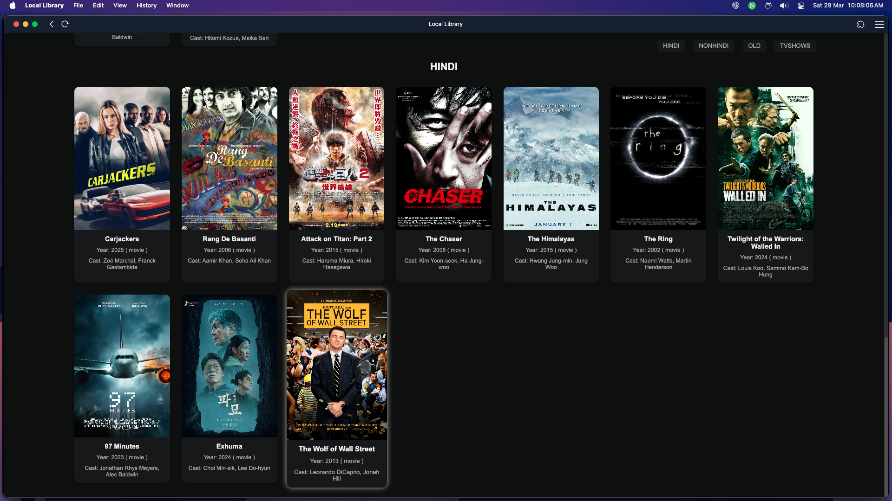
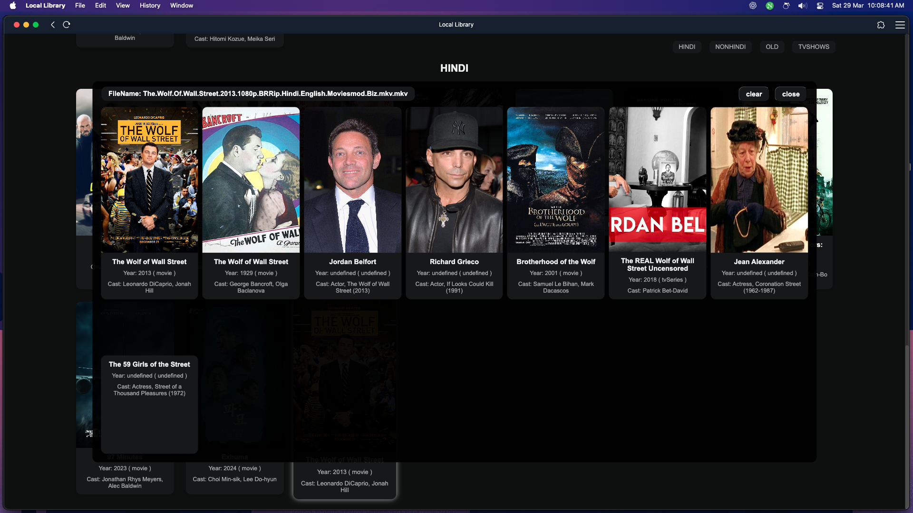

# Local Library

Local Library is a web application that scans, displays, and manages movies and TV shows stored on a specified drive. It allows users to browse their media collection, fetch metadata from the [IMDb API](https://rapidapi.com/rahilkhan224/api/imdb-movies-web-series-etc-search), and open files using their preferred media player on any OS.

## Table of Contents

- [Features](#features)
- [Installation](#installation)
  - [Prerequisites](#prerequisites)
  - [Steps](#steps)
- [Usage](#usage)
- [Future Enhancements](#future-enhancements)
- [UI Image](#ui)
- [Edit Image](#edit)
- [License](#license)

## Features <a name="features"></a>

- **Automatic Folder Scanning:** Reads movie and TV show files from a designated directory.
- **Dynamic UI:** Displays filenames as interactive cards and updates automatically when new files are added.
- **Navigation:** Supports both mouse and keyboard navigation (including Vim-style keys: `h, j, k, l`).
- **Metadata Fetching:** Uses the RapidAPI IMDb API to fetch movie/show details.
- **Metadata Editing:** Allows users to modify metadata by selecting from API results.
- **File Launching:** Opens selected files using the default media player on any OS.
- **Local Data Storage:** Saves fetched metadata in a temporary folder to minimize API calls.

## Installation <a name="installation"></a>

### Prerequisites <a name="prerequisites"></a>

- Node.js (latest LTS version recommended)
- An active RapidAPI key for the [IMDb API](https://rapidapi.com/rahilkhan224/api/imdb-movies-web-series-etc-search)
- Compatible with all major operating systems

### Steps <a name="steps"></a>

1. **Clone the Repository:**

   ```bash
   git clone https://github.com/wormcracker/local-library.git
   cd local-library
   ```

2. **Install Dependencies:**

   ```bash
   npm install
   ```

3. **Configure the Server:**

   - Edit the **API key** in `public/script.js`.
   - Change the **media directory and player settings** in `server.js`.

4. **Run the Server:**

   ```bash
   node server.js
   ```

5. **Open in Browser:**

   - Navigate to `http://localhost:<port>` in your web browser.

## Usage <a name="usage"></a>

- Use **arrow keys** or **h, j, k, l** for navigation.
- Press **Enter**, **"o"**, or click to open a file.
- Click on a **title** or press **"i"** to open the IMDb page for that file.
- Use the **Edit button** to modify metadata.

## Future Enhancements <a name="future-enhancements"></a>

- Improve metadata caching strategy.
- Implement user authentication for metadata edits.

## UI <a name="ui"></a>



## Edit <a name="edit"></a>



## License <a name="license"></a>

This project is licensed under the **MIT License**.
