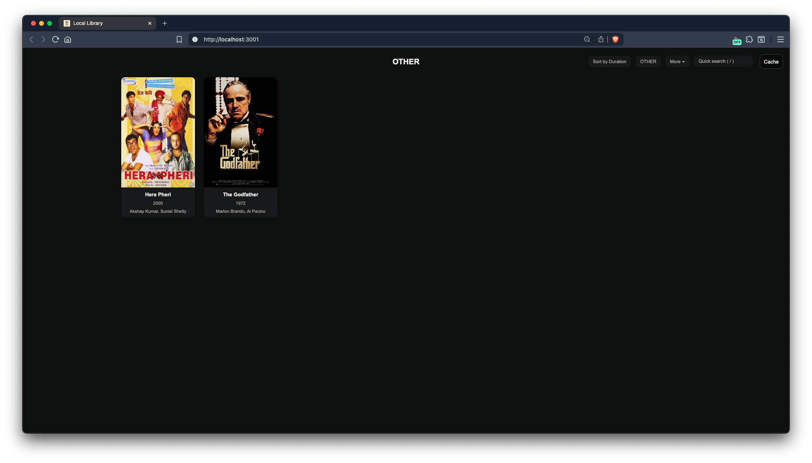
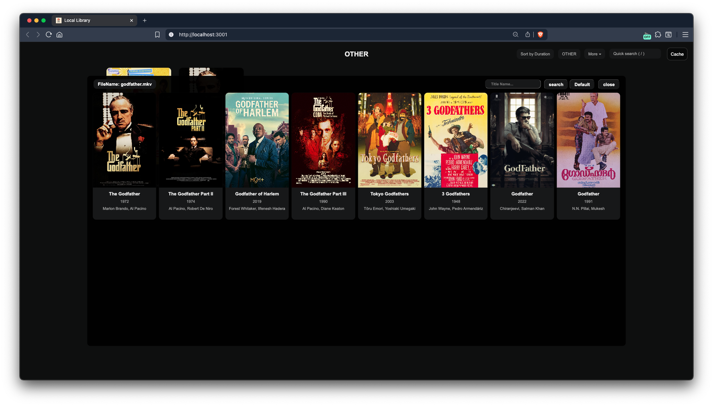

<div align="center">
	<a href="https://github.com/wormcracker/local-library">
		
	</a>
	<h3 align="center">Local Library</h3>
	<p align="center">
		<a href="https://github.com/wormcracker/local-library/issues">Report Bug</a>
		·
		<a href="https://github.com/wormcracker/local-library/issues">Request Feature</a>
	</p>
</div>

**Local Library** is a locally hosted application that scans, displays, and manages movies and TV shows stored on a specified drive. It allows users to browse their media collection, fetch metadata from the [IMDb API](https://rapidapi.com/rahilkhan224/api/imdb-movies-web-series-etc-search), and open files using their preferred media player on any OS.

## Table of Contents

- [Features](#features)
- [Installation](#installation)
  - [Prerequisites](#prerequisites)
  - [Steps](#steps)
- [Usage](#usage)
- [Keyboard Navigation](#keyboard-navigation)
- [Fallback & Error Handling](#fallback--error-handling)
- [Future Enhancements](#future-enhancements)
- [UI Image](#ui)
- [Edit Image](#edit)
- [License](#license)

## Features <a name="features"></a>

- **Automatic Folder Scanning:** Reads movie and TV show files from a designated directory.
- **Dynamic UI:** Displays filenames as interactive cards and updates automatically when new files are added.
- **Navigation:** Supports both mouse and keyboard navigation (including Vim-style keys: `h, j, k, l`).
- **Metadata Fetching:** Uses the RapidAPI IMDb API to fetch movie/show details.
- **Metadata Editing:** Allows users to modify metadata by selecting from API results.
- **File Launching:** Opens selected files using the default media player on any OS.
- **Local Data Storage:** Saves fetched metadata in a temporary folder to minimize API calls.
- **Share, Export and Cache:** Allows users to share, export and cache their favourites.
- **Fallback UI:** Beautiful fallback screens guide users if the app is opened without a server.
- **Graceful Error Handling:** If the server or media folder is unavailable, the UI displays a clear error and allows access to cached data.

## Installation <a name="installation"></a>

### Prerequisites <a name="prerequisites"></a>

- Node.js (latest LTS version recommended)
- An active RapidAPI key for the [IMDb API](https://rapidapi.com/rahilkhan224/api/imdb-movies-web-series-etc-search)
- Compatible with all major operating systems

### Steps <a name="steps"></a>

1. **Clone the Repository:**

   ```bash
   git clone https://github.com/wormcracker/local-library.git
   cd local-library
   ```

2. **Install Dependencies:**

   ```bash
   npm install
   ```

3. **Configure the Server:**
   - **API Key:**
     Edit your RapidAPI key in [`public/js/settings.js`](./public/js/settings.js).
   - **Media Directory & Player:**
     Set your media folder and player command in [`settings.js`](./settings.js).

4. **Run the Server:**

   ```bash
   node server.js
   ```

5. **Open in Browser:**
   - Navigate to `http://localhost:${port}` in your web browser.

## Usage <a name="usage"></a>

- Press or click to open a file.
- Click on a **title** to open the IMDb page for that file.
- Use the **Edit button** to modify metadata.
- Use the **Sort** button to toggle between sorting by date or duration.
- Use the **search bar** (`/` or `Ctrl+K`) for quick filtering.
- Use the **/** or **Ctrl+K**: Focus search bar

## Keyboard Navigation <a name="keyboard-navigation"></a>

- Toggle keyboard navigation with **Ctrl+J**.
- Supported keys:
  - **h/j/k/l** or **Arrow keys**: Move left/down/up/right
  - **o** or **Enter**: Open/play selected file
  - **e**: Edit metadata
  - **d**: Delete file
  - **s**: Change sort order
  - **i**: Open IMDb link
  - **/** or **Ctrl+K**: Focus search bar

## Fallback & Error Handling <a name="fallback--error-handling"></a>

- **Direct File Access:**  
  If you open `index.html` or `old-library.html` directly (without running the server), a beautiful fallback UI will appear with clear setup instructions.
- **Server or Folder Errors:**  
  If the `/files` endpoint is unavailable or the media folder is misconfigured, the app displays a clear error message in the UI and provides a button to open your cached library.
- **Cached Library:**  
  The "Old Library" view (`old-library.html`) allows you to browse, export, or import your locally cached metadata even if the server is down.

## Future Enhancements <a name="future-enhancements"></a>

- Improve metadata caching strategy.
- Implement user authentication for metadata edits.

## UI <a name="ui"></a>



## Edit <a name="edit"></a>



## License <a name="license"></a>

This project is licensed under the **MIT License**.

---

**Troubleshooting:**  
If you see a fallback screen or error, ensure you have:

- Installed Node.js
- Run `npm install`
- Started the server with `node server.js`
- Configured your media folder and API key correctly

For more help, see the [installation guide](https://github.com/wormcracker/local-library#installation).
